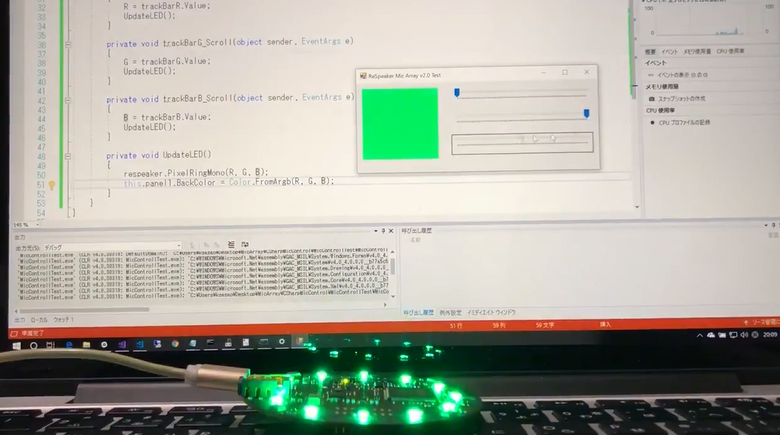

# ReSpeakerSharp
ReSpeaker Mic Array v2.0 API for C#

- https://twitter.com/ksasao/status/1020627412520820736
- https://twitter.com/ksasao/status/1020627412520820736

## Target
- Seeed ReSpeaker Mic Array v2.0
  - http://wiki.seeedstudio.com/ReSpeaker_Mic_Array_v2.0
- Visual Studio 2017
- .NET Framework 4.6.1

## Setup
- Install DFU and LED Control Driver
  - http://wiki.seeedstudio.com/ReSpeaker_Mic_Array_v2.0/#install-dfu-and-led-control-driver

## How to use
- See Examples
  - Command Prompt
    - https://github.com/ksasao/ReSpeakerSharp/blob/master/Examples/CmdSample/Program.cs
  - Windows Forms
    - https://github.com/ksasao/ReSpeakerSharp/blob/master/Examples/WinFormsSample/Form1.cs